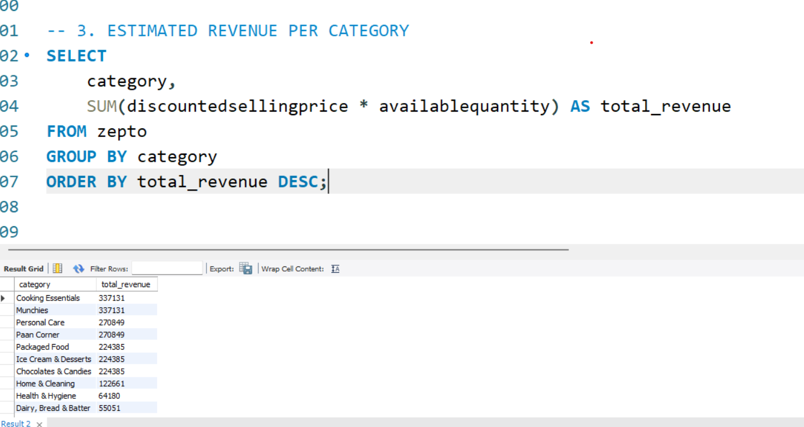

# 📊 Zepto SQL Data Analysis Project  
SQL-based analysis and cleaning of Zepto’s product dataset with insights on pricing, discounts, revenue, and inventory 

*End-to-End Data Cleaning • Exploration • Insights*

---

## 📌 Project Overview  
This repository contains a complete **SQL data cleaning and analysis project** using Zepto’s grocery product dataset.  
It demonstrates real-world SQL skills including data profiling, cleaning, transformation, exploratory analysis, and generating actionable business insights.

---

## 🗂 Dataset Description  
The dataset includes product-level information from Zepto:

| Column | Description |
|-------|-------------|
| **name** | Product name |
| **category** | Product category |
| **mrp** | Maximum Retail Price (in paise before conversion) |
| **discountpercent** | Discount offered |
| **discountedsellingprice** | Final selling price |
| **availablequantity** | Units available |
| **weightingms** | Weight in grams |
| **outofstock** | Stock status (0 = available, 1 = out of stock) |
| **sku_id** | Auto-increment unique product ID |

---

## 🧹 Data Cleaning Performed  
- Removed rows with **invalid pricing (MRP = 0 or selling price = 0)**  
- Converted currency from **paise → rupees**  
- Added **SKU_ID as primary key**  
- Checked for **null values and duplicates**  
- Validated stock and weight entries  
- Ensured clean, analysis-ready data  

---

## 🔎 Exploratory Data Analysis  
Initial exploration includes:

- Total number of products  
- Duplicate item detection  
- Category distribution  
- Out-of-stock vs in-stock items  
- Pricing and discount patterns  

--- 

## 📈 Business Insights & SQL Analysis  
This project answers key business questions:

### **1. Top 10 Best-Value Products**  
Products with the highest discount percentage.

### **2. High-MRP Out-of-Stock Items**  
Helps identify high-demand premium items.

### **3. Estimated Revenue per Category**  
Revenue = selling price × available quantity.

### **4. High MRP but Low Discount Products**  
Useful for pricing & margin strategy.

### **5. Top 5 Categories by Average Discount**  
Insight for marketing & promotions.

### **6. Price per Gram Analysis**  
Finds cheapest/best value products.

### **7. Product Weight Classification**  
Classified as **Low, Medium, Bulk**.

### **8. Inventory Weight per Category**  
Shows total weight contribution of each category.

---

## 🛠 Technologies Used  
- **MySQL**  
- SQL Cleaning & Transformation  
- Analytical Querying  
- Business Insight Generation  

---
---
## 📸 SQL Query Snapshots

Here are a few example queries from the project:

### 🔹 Top 5 Categories by Average Discount.

  

### 🔹  Estimated Revenue per Category.

  

---

## 👩‍💻 Author  
**Amisha Nakoti**  
*Data Analyst | SQL | BI | Data Projects*
